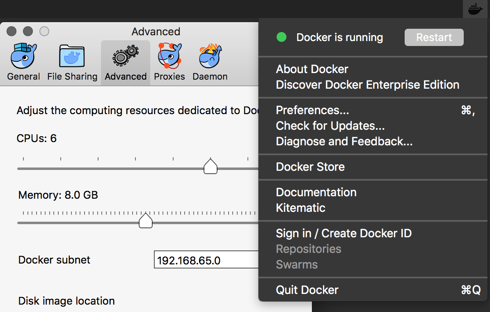
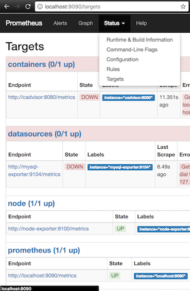
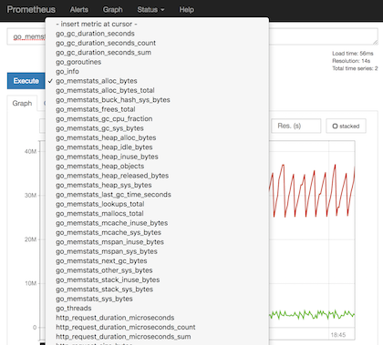

# Prometheus & Grafana Exercise #1

## Setup Docker

First, ensure you are using an up-to-date docker engine.

In the terminal,

1. Run `docker info` and check for any errors
1. Run `docker --version` and ensure you have version >=17.06

Ensure you have set enough resources for Docker to run smoothly:
In the taskbar, click the whale icon → Preferences → Advanced

(I set 6 CPUs and 8GB RAM for Docker)




## Install Tutorial

1. Run in terminal:
```sh
git clone git@github.com:shelleg/prom_exercise_01.git
cd prom_exercise_01

```

2. choose 1 from 2 option :

```sh
docker-compose up -d

# OR,

docker stack deploy -c docker-compose.yml mon
```

## Browse node-exporter
1. Open browser : http://localhost:9100/
2. click metrics
3. refresh and see the change values
   of machine metrics. 
   prometheus server takes help from various exporters to collect metrics (Pull mechanism) 
    (there is an exporter for each service: mysql-exporter, node-exporter etc...)

## Browse Prometheus.io - leading open source software for scraping/querying/graphing/monitoring/alerting timeseries data
1. Open your browser :  http://localhost:9090 
2.1 click Status → Configuratoin (u can configure rules/alerting/scraping ) 
2.2 click Status → Targets 
2.3 click Status → Rule (example rules file with alert is configure same as recording rules with  alert.rules.yml file)
```sh
groups:
- name: rule_example
  rules:
  - alert: HighErrorRate
    expr: job:request_latency_seconds:mean5m{job="myjob"} > 0.5
    for: 10m
    labels:
      severity: page
    annotations:
      summary: High request latency
```      
3. validate that Prometheus can reach (State up) only 2 out of the 4 targets we told it to poll (in prometheus.yml)
4. click Graph to see the build-in graph visualization
5. see a long list of metrics in the drop-down. (These metrics are coming from the container named "node exporter" which produces OS-level metrics for Prometheus to poll)
6. choose a metrics
7. click execute 
8. click console
9. click graph
10. choose 15m
11. add formula in textbox above (*10 for instance)
12. refresh every minute to see a change.
13. repeat few times 6-10

## Browse grafana.com - leading open source software for time series analytics. has better graphs/dashboard/visualization suite then prometheus 
1. Open your browser : http://0.0.0.0:3000/
2. login with admin admin
3. add data source 
4. set name = monitoring_1
5. choose type=prometheus
6. set url=http://prometheus:9090/
7. set access= proxy
8. click save and test
9. click data source → monitoring_1
10. verify it exists
11. click dashboard → new → graph 
12. click edit and set a metrics or a query u choose from prometheus(like go_gc_duration_seconds_count or node_cpu)
13. set last 15 minutes (above)
14. see the graph now :-)
15. click add row
15. repeat few times 12-15 
16. ctrl+s to save the dashboard as dashboard_1
17. try to import existing graph from grafana.com to your dashboard






## Exercise
1. Add the cAdvisor exporter from https://github.com/google/cadvisor
2. Add a MySQL container to docker-compose.yml
3. Add a MySQL exporter for Prometheus     

## Expected Solution

You should have a docker-compose.yml file that includes:

- Prometheus
- MySQL
- Node Exporter  # exporter for node metrics
- cAdvisor       # exporter for containers that collect from  docker deamon the metrics of all running containers and send it to prometheus
- MySQL Exporter # exporter for mysql metrics

All targets in http://localhost:9090/targets should be **UP** and **green**.


#alert
add alertmanager service to docker-compose.yaml
ALERT: service_down
expr: if node>0.5

## Docker Tips
2 ui tools for docker:
- docker-visualizer
- portainer


At any point, you can always remove all containers and start over.
Depending if you're using Swarm Mode or not, to REMOVE the stack, run:

For Native Docker:
```sh
docker-compose stop
docker-compose rm -f
```

For Docker Swarm:
```sh
docker stack rm mon
```

### How to Find if You're Using Swarm Mode

```
docker info | grep -i swarm
```
